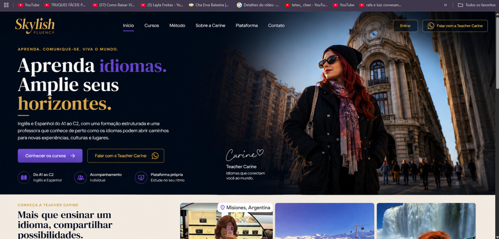
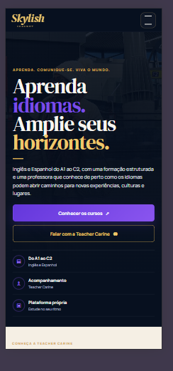

<div align="center">

# 🌎 Skylish Fluency

### Plataforma educacional web para aprendizagem de idiomas

Uma experiência digital desenvolvida com foco em aprendizagem, organização, interação e experiência do usuário.

[](https://skylish-fluency-plataforma.web.app/)

</div>

---

## 📖 Sobre o projeto

O **Skylish Fluency** é uma plataforma educacional web desenvolvida para proporcionar uma experiência moderna e organizada de aprendizagem de idiomas.

O projeto combina uma página institucional com um ambiente dedicado aos alunos, reunindo recursos de estudo, acompanhamento de evolução, atividades e gerenciamento de conteúdo em uma única experiência digital.

Seu desenvolvimento faz parte da minha evolução prática em **Desenvolvimento Web**, aplicando conceitos de Front-end, responsividade, UI/UX, JavaScript, autenticação, persistência de dados e integração com serviços externos.

---

## 📸 Preview

### 🖥️ Experiência Desktop

Interface principal desenvolvida com foco em identidade visual, hierarquia das informações e navegação.



### 📱 Experiência Mobile

A experiência também foi adaptada para smartphones, reorganizando navegação, conteúdo e chamadas para ação para diferentes tamanhos de tela.

<p align="center">
  
</p>

---

## ✨ Principais funcionalidades

- 👤 Área dedicada ao aluno
- 📚 Organização de cursos e aulas
- 📝 Exercícios e quizzes
- 🏆 Sistema de XP e gamificação
- 📈 Acompanhamento de evolução
- 📖 Biblioteca de conteúdos
- 📓 Caderno de estudos
- 💬 Comunidade
- 🔔 Sistema de notificações
- 🎓 Certificados
- 🔐 Autenticação e controle de acesso
- ⚙️ Gerenciamento de conteúdo
- 📱 Interface responsiva
- 🌐 Recursos de PWA
- 📶 Experiência offline parcial

---

## 🛠️ Tecnologias

<p>


</p>

---

## 📱 Responsividade

O Skylish Fluency foi desenvolvido considerando diferentes tamanhos de tela.

A interface adapta elementos como:

- navegação;
- tipografia;
- disposição dos conteúdos;
- cards;
- botões e chamadas para ação;
- áreas de estudo;
- menus e componentes interativos.

O objetivo é manter uma experiência consistente tanto em **desktop quanto em dispositivos móveis**.

---

## 🗂️ Estrutura do projeto

```text
skylish-fluency/
│
├── assets/
│   └── images/
│
├── css/
│
├── docs/
│   ├── preview-home-desktop.png
│   └── preview-home-mobile.png
│
├── firebase/
│
├── js/
│
├── pages/
│   ├── auth/
│   └── student/
│
├── index.html
├── offline.html
├── service-worker.js
├── site.webmanifest
├── firebase.json
└── README.md
```

---

## 💡 Desenvolvimento e aprendizados

O desenvolvimento do Skylish Fluency permitiu trabalhar diferentes áreas de uma aplicação web.

Entre os principais conhecimentos colocados em prática estão:

`Front-end Development`

`Responsive Design`

`UI/UX`

`JavaScript`

`Firebase`

`Autenticação`

`Persistência de dados`

`Integração com serviços externos`

`Organização de interfaces`

`Experiência do usuário`

O projeto também passou por diferentes etapas de evolução e refinamento, principalmente na experiência mobile, organização das funcionalidades e ambiente do aluno.

---

## 🔐 Segurança

A versão pública deste repositório foi preparada para apresentação em portfólio.

Credenciais privadas e configurações que não devem fazer parte de um repositório público não são necessárias para compreender a estrutura e o desenvolvimento do projeto.

Para utilizar integrações externas em outro ambiente, é necessário configurar os respectivos serviços e revisar suas regras de acesso.

---

## 🚀 Demonstração

A plataforma possui uma versão publicada para demonstração.

### 🌐 [Acessar Skylish Fluency](https://skylish-fluency-plataforma.web.app/)

---

## 👨🏽‍💻 Autor

### Antony Gabriel

Estudante de **Análise e Desenvolvimento de Sistemas (ADS)** e desenvolvedor web em formação, com foco em **Desenvolvimento Web, Front-end e UI/UX**.

[](https://github.com/antonygabrieldev)

---

<div align="center">

### 💻 Desenvolvimento Web • Front-end • UI/UX

Projeto desenvolvido como parte da minha evolução profissional em tecnologia.

**Antony Gabriel © 2026**

</div>
`Front-end` • `UI/UX` • `Responsividade` • `Tecnologia`

</div>
